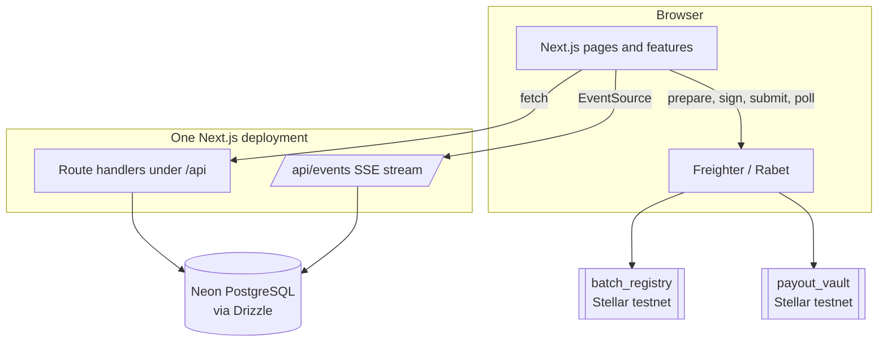

## The shape

There is no separate backend. Route handlers, pages and the event stream all ship in one Next.js deployment.

## Layers

| Path | Holds |
| --- | --- |
| `src/app/(platform)` | Pages: onboarding, dashboard, batches, farmers, submission |
| `src/app/api` | Route handlers for batches, lots, quality, funding, approval, events, health |
| `src/features/*` | Feature modules — `batches`, `farmers`, `wallets`, `events`, `dashboard`, `submission` — each with components and server code |
| `src/lib/db` | Drizzle schema and client |
| `src/lib/soroban` | Contract invocation, network config, per-contract wrappers |
| `contracts/batch_registry` | The harvest record |
| `contracts/payout_vault` | The settlement record |

Code is organised **by feature, not by kind** — `src/features/batches/` carries its own components and its own server functions. Moving between "what the user sees" and "what the server does" for one concern means moving within a folder rather than across the tree.

## Two contracts, on purpose

The registry owns the harvest: batch, lots, totals, quality. The vault owns the settlement: funded amount, approval.

They do not read each other. The vault stores a `registry_contract` address but never calls it, and the registry stores a `vault_contract` address it never calls either.

The upside is independence — neither contract's storage can corrupt the other's, and either can be redeployed alone. The cost is that **nothing on chain checks the funded amount against the batch total**. That comparison is available to anyone through two public reads, but no contract performs it. See [scope](/AgriBatch_Pay/overview/scope/#fund_vault-overwrites).

## Everything is written twice

Each action writes to PostgreSQL *and* to a contract.

| Store | Job | Authority |
| --- | --- | --- |
| Soroban | Signed, timestamped, publicly readable record | The record |
| PostgreSQL | Search, listing, per-farmer payout tracking, events, wallet history | The product |

The database carries things the ledger should not: farmer names, payout tracking, wallet interaction history including failures, and the event feed.

When the two disagree, the chain is the record — `get_batch` and `get_release` are open reads, so anyone can check without the application's cooperation.

## The invocation path

The browser signs; the server does not. `src/lib/soroban/invoke-contract.ts` builds, prepares, signs, submits and **polls** — covered in [contract invocation path](/AgriBatch_Pay/internals/invocation/).

The server has no Stellar key. It cannot create a batch, add a lot or approve a settlement, because every one of those needs a signature it does not hold.

## Live updates

`/api/events` is a server-sent event stream polling `app_events` every three seconds per connection. See [watch the event stream](/AgriBatch_Pay/using/events/) — including the unhandled-rejection failure that shaped its error handling.

## Next

- [Batch lifecycle](/AgriBatch_Pay/internals/lifecycle/)
- [Contracts](/AgriBatch_Pay/internals/contracts/)
- [Database schema](/AgriBatch_Pay/internals/schema/)
