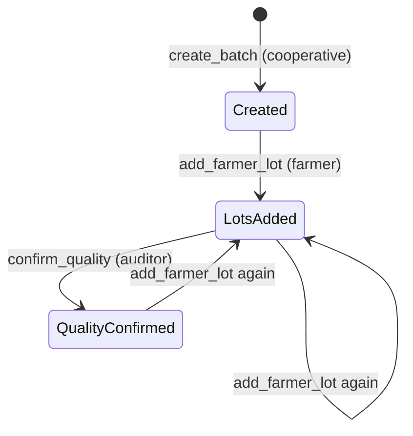
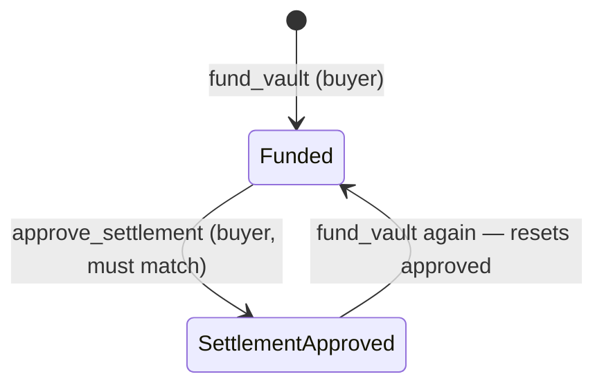

Two contracts, two independent state machines. Neither knows about the other.

## Registry: the batch

| Status | Means |
| --- | --- |
| `Created` | Registered. No lots, total is zero |
| `LotsAdded` | At least one lot; `total_amount` is their sum |
| `QualityConfirmed` | An address signed a quality confirmation |

:::caution[The last arrow is the problem]
`add_farmer_lot` does not check the status, so a lot added after confirmation raises the total and pushes the batch back to `LotsAdded`.

`quality_confirmed` stays `true` while it happens — so a batch can read `LotsAdded` with `quality_confirmed: true`, describing a total nobody inspected. See [scope](/AgriBatch_Pay/overview/scope/#lots-can-be-added-after-quality-confirmation).
:::

There is no terminal state. Nothing marks a batch settled, and nothing prevents a lot being added a year later.

## Vault: the release

| Status | Means |
| --- | --- |
| `Funded` | A release record exists with a stated amount |
| `SettlementApproved` | The recorded buyer approved it |

That last arrow is real. `fund_vault` writes a fresh record without checking for an existing one, so calling it again on an approved release **overwrites it and resets `approved` to false**.

## The two machines never meet

| Not checked | Consequence |
| --- | --- |
| Funded amount against `total_amount` | The vault records any amount the buyer passes |
| Quality confirmation before funding | An uninspected batch can be funded and approved |
| Vault address on the batch against the vault actually used | A batch can name one vault and settle through another |

None of these produce an error. They produce records that disagree — and because both reads are public, anyone comparing `get_batch` with `get_release` can see the disagreement.

That comparison is the audit. The contracts provide the evidence; they do not draw the conclusion.

## What the database adds

`batch_status` in PostgreSQL mirrors the registry status and drives the interface. `farmer_lots.paid` and `payout_tx_hash` track per-farmer payment, which no contract method touches.

So "has this farmer been paid" is an application fact, not a chain fact. Treat it accordingly.

## Next

- [Contracts](/AgriBatch_Pay/internals/contracts/) — every method and check
- [Database schema](/AgriBatch_Pay/internals/schema/)
