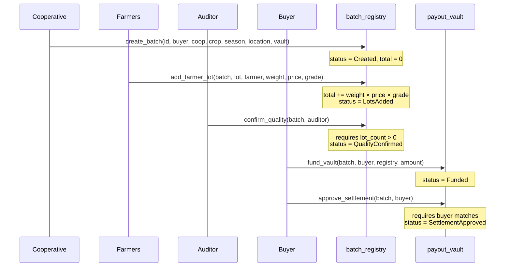

Five steps, five signatures, five transactions. This page follows one batch from registration to approved settlement.

## The path



## Step by step

### 1. The cooperative registers the batch

`create_batch` on the **batch registry**, signed by the **cooperative**.

It records the buyer, the cooperative, the crop type, the season, the location, the asset code and the address of the payout vault this batch will settle through. The batch starts at `Created` with `lot_count: 0` and `total_amount: 0`.

The contract refuses a batch id that already exists.

### 2. Farmers add their lots

`add_farmer_lot`, signed by **the farmer** — not the cooperative, and this is the point of the whole design.

Each lot carries a weight in kilograms, a price per kilogram and a grade. The contract computes:

```
payout = weight_kg × price_per_kg × grade
```

…and adds it to the batch total, incrementing `lot_count` and moving the batch to `LotsAdded`.

:::note[Grade multiplies, it does not adjust]
A grade of 3 pays three times a grade of 1, not "slightly more". Grade 0 is treated as 1, so a missing grade does not zero out a farmer's payout. Whether a straight multiplier is the right pricing model is a business decision — but it is the one implemented, and a farmer reading this should know that grade is the single most consequential number in their lot.
:::

The farmer's signature is what makes the lot theirs. The cooperative cannot register a lot on a farmer's behalf, so the weight and price on chain are figures the farmer authorised.

### 3. An auditor confirms quality

`confirm_quality`, signed by the **auditor**.

The contract requires `lot_count > 0` — quality cannot be confirmed for an empty batch — then sets `quality_confirmed` and moves the batch to `QualityConfirmed`.

:::caution[Any address can confirm quality]
The contract calls `auditor.require_auth()` but does **not** compare the auditor against any address stored on the batch. So the signature proves *someone* signed, and the event records *who*, but the contract does not enforce that they were the appointed inspector.

That is a real limitation, not a subtlety. It is covered in [what it does and does not do](/AgriBatch_Pay/overview/scope/).
:::

### 4. The buyer funds the vault

`fund_vault` on the **payout vault**, signed by the **buyer**.

It writes a release record: batch id, buyer, the registry contract address, the funded amount, `approved: false`, status `Funded`.

**No token moves.** This records that the buyer states they have funded the amount. See [scope](/AgriBatch_Pay/overview/scope/).

### 5. The buyer approves settlement

`approve_settlement`, signed by the **buyer**.

The contract reads the release and refuses unless the signer matches the recorded buyer — the one authorisation check in the vault. Then it sets `approved: true`, records `last_actor` and moves the status to `SettlementApproved`.

## What the application does alongside

Each contract call is mirrored into PostgreSQL so the platform is usable: batches are searchable, lots are listed per batch, and payout status is tracked per farmer.

Every step also writes an **app event**, and those events feed a server-sent event stream at `/api/events`. A cooperative watching a settlement sees lots arrive and the total climb without refreshing.

Wallet interactions are recorded too — including the failures. A connection that was rejected or a transaction that never landed is a row in `wallet_interactions` with `success: false` and an error message.

## Where to go next

| You want to | Read |
| --- | --- |
| Do this yourself | [Connect a wallet](/AgriBatch_Pay/using/wallets/), then [register a batch](/AgriBatch_Pay/using/register-a-batch/) |
| Know the limits | [What it does and does not do](/AgriBatch_Pay/overview/scope/) |
| See the method signatures | [Contracts](/AgriBatch_Pay/internals/contracts/) |
| Understand the states | [Batch lifecycle](/AgriBatch_Pay/internals/lifecycle/) |
